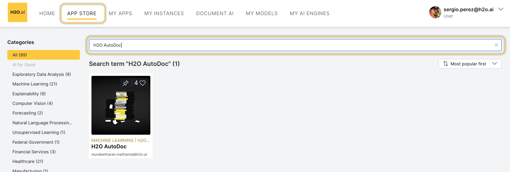
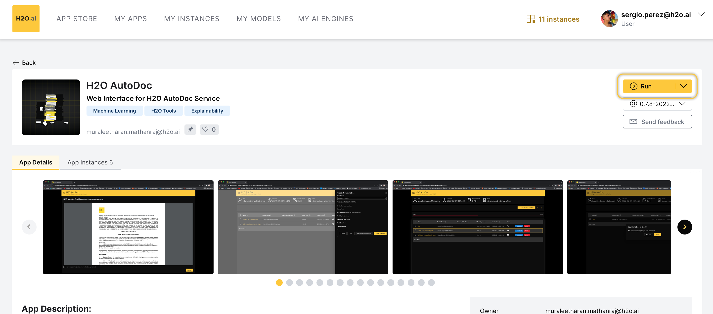
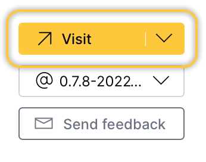

import Tabs from '@theme/Tabs';
import TabItem from '@theme/TabItem';
import Icon from "@material-ui/core/Icon";

# Access [application_name] 

You can access [application_name] through an instance that you can create on the <a href="https://cloud.h2o.ai/login?" target="_blank" >H2O AI Cloud (**HAIC**)</a>. To access [application_name]:

- [Step 1: Access HAIC](#step-1-access-haic) 
- [Step 2: Search [application_name]](#step-2-search) 
- [Step 3: Run [application_name]](#step-3-run-) 
- [Step 4: [application_name] instance](#step-4-) 

## Step 1: Access HAIC

Access your <a href="https://cloud.h2o.ai/login?" target="_blank" >H2O AI Cloud (**HAIC**)</a> account. 

## Step 2: Search [application_name]

1. In HAIC, click **APP STORE**.
2. In the **HAIC** search bar, search `[application_name]`.

Now, select the [application_name] tile. Details about [application_name] appear. 

## Step 3: Run [application_name]

1. To start a [application_name] instance, click **Run**. 

  

## Step 4: [application_name] instance

Now, the H2O AI Cloud is starting an instance of [application_name] for you. While you have a starting/running instance, the **Run** button will change its name to **Visit**. 

1. To open [application_name] in a new tab, click **Visit**.

:::info Note
  - The latest version of [application_name] is preselected. 
  - In the [application_name] instance, several items will be installed. Right after, you will be able to use [application_name]. All items are automatically installed when you start an instance.
:::

## Pause or terminate instance

You can pause or terminate an instance of [application_name]. 

- **Pause**: Pausing an instance reduces computational resources (and is less expensive). In other words, the cost of having an instance decreases. 
- **Terminate**: Terminating an instance deletes the instance permanently.

:::info Note 
  Customers pay for <a href="https://cloud.h2o.ai/login?" target="_blank" >H2O AI Cloud</a> via AI Units so that as you consume more resources, you pay more. 
:::

<Tabs className="unique-tabs">
  <TabItem value="pause" label="Pause" default>
  You can <b>Pause</b> an instance in the <i>app details</i> page:
    
    
  <ol>
    <li>In the <b>app details</b> page, click the <b>My instances</b> tab. </li>
    <li>Locate the instance you want to pause.</li>
    <li>Click <b>Pause</b>.</li>
    
  </ol>

  You can also <b>Pause</b> an instance in the <b>My Instances</b> page: 
  
  <ol>
    <li>In the <b>H2O AI Cloud</b> menu, click <b>My Instances</b>.</li>
    <li>Locate the instance you want to pause.</li>
    <li>Click <b>Pause</b>.</li>
    
  </ol>
  </TabItem>
  <TabItem value="terminate" label="Terminate">
  You can <b>Terminate</b> an instance in the <b>app details</b> page:
    
    
  <ol>
    <li>In the <b>app details</b> page, click the <i>My instances</i> tab. </li> 
    <li>Locate the instance you want to terminate.</li>
    <li>Click <Icon>expand_more</Icon> <b>Expand</b>. </li>
    <li>Click <b>Terminate</b>.</li>
    
  </ol>

  You can also <b>Terminate</b>  an instance in the <b>My Instance</b> page: 

  <ol>
    <li>In the <b>H2O AI Cloud</b> menu, click <b>My Instances</b>.</li>
    <li>Locate the instance you want to terminate.</li>
    <li>Click <Icon>expand_more</Icon> <b>Expand</b>.</li>
    <li>Click <b>Terminate</b>.</li>
    
    </ol>
    </TabItem>
</Tabs>
