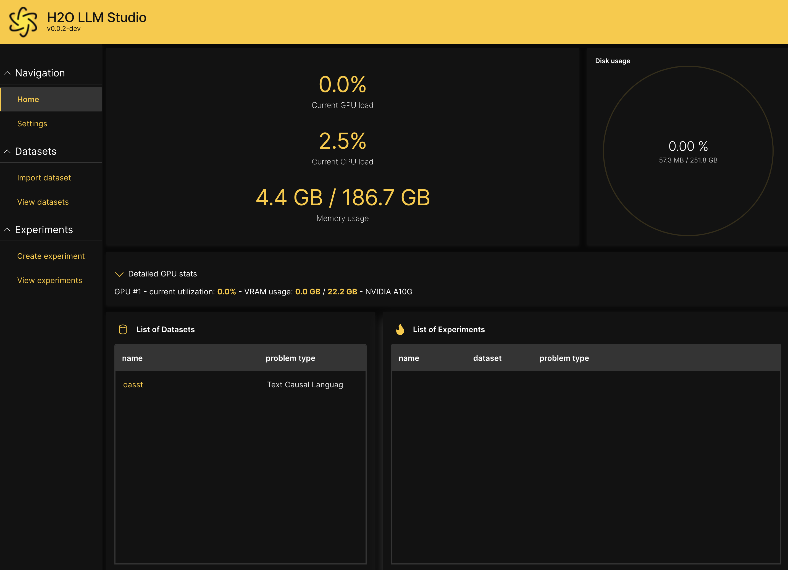

import Tabs from '@theme/Tabs';
import TabItem from '@theme/TabItem';

# Set up H2O LLM Studio

## Prerequisites

H2O LLM Studio requires the following minimum requirements:

- A machine with Ubuntu 16.04+ with atleast one recent Nvidia GPU
- Have at least 128GB+ of system RAM. Larger models and complex tasks may require 256GB+ or more.
- Nvidia drivers v470.57.02 or a later version
- Access to the following URLs:
  - developer.download.nvidia.com
  - pypi.org
  - huggingface.co
  - download.pytorch.org
  - cdn-lfs.huggingface.co 

:::info Notes
- Atleast 24GB of GPU memory is recommended for larger models.
- The required URLs are accessible by default when you start a GCP instance, however, if you have network rules or custom firewalls in place, it is recommended to confirm that the URLs are accessible before running `make setup`.
:::


## Installation

:::note Installation methods
<Tabs className="unique-tabs">
  <TabItem value="recommended-install" label="Recommended installation" default>
  <p>The recommended way to install H2O LLM Studio is using pipenv with Python 3.10. To install Python 3.10 on Ubuntu 16.04+, execute the following commands.</p>
  <p><b>System installs (Python 3.10)</b></p>
  <pre><code>
    sudo add-apt-repository ppa:deadsnakes/ppa   <br></br>
    sudo apt install python3.10  <br></br>
    sudo apt-get install python3.10-distutils  <br></br>
    curl -sS https://bootstrap.pypa.io/get-pip.py | python3.10 
  </code></pre>
  <p><b>Install NVIDIA drivers (if required)</b><br></br>
  If you are deploying on a 'bare metal' machine running Ubuntu, you may need to install the required Nvidia drivers and CUDA. The following commands show how to retrieve the latest drivers for a machine running Ubuntu 20.04 as an example. You can update the following based on your respective operating system.</p>
  <pre><code>
    wget https://developer.download.nvidia.com/compute/cuda/repos/ubuntu2004/x86_64/cuda-ubuntu2004.pin <br></br>
    sudo mv cuda-ubuntu2004.pin /etc/apt/preferences.d/cuda-repository-pin-600 <br></br>
    wget https://developer.download.nvidia.com/compute/cuda/11.4.3/local_installers/cuda-repo-ubuntu2004-11-4-local_11.4.3-470.82.01-1_amd64.deb <br></br>
    sudo dpkg -i cuda-repo-ubuntu2004-11-4-local_11.4.3-470.82.01-1_amd64.deb <br></br>
    sudo apt-key add /var/cuda-repo-ubuntu2004-11-4-local/7fa2af80.pub <br></br>
    sudo apt-get -y update <br></br>
    sudo apt-get -y install cuda
  </code></pre>
  <p><b>Create virtual environment (pipenv)</b>  <br></br>
  The following command creates a virtual environment using pipenv and will install the dependencies using pipenv.
  <pre><code>make setup</code></pre>
   </p>
  </TabItem>
  <TabItem value="using-requirements" label="Using requirements.txt">
  <p>If you wish to use conda or another virtual environment, you can also install the dependencies using the <code>requirements.txt</code> file. </p>
  <pre><code>pip install -r requirements.txt</code></pre>
  </TabItem>
</Tabs>
:::


## Run H2O LLM Studio

There are several ways to run H2O LLM Studio depending on your requirements.

1. [Run H2O LLM Studio GUI](#run-h2o-llm-studio-gui)
2. [Run using Docker from a nightly build](#run-using-docker-from-a-nightly-build)
3. [Run by building your own Docker image](#run-by-building-your-own-docker-image)
4. [Run with the CLI (command-line interface)](#run-with-command-line-interface-cli)

### Run H2O LLM Studio GUI

Run the following command to start the H2O LLM Studio. 

```
make llmstudio
```

This will start the H2O Wave server and the H2O LLM Studio app. Navigate to [http://localhost:10101/](http://localhost:10101/) (we recommend using Chrome) to access H2O LLM Studio and start fine-tuning your models. 



If you are running H2O LLM Studio with a custom environment other than Pipenv, start the app as follows: 

```
H2O_WAVE_MAX_REQUEST_SIZE=25MB \
H2O_WAVE_NO_LOG=True \
H2O_WAVE_PRIVATE_DIR="/download/@output/download" \
wave run app
```

### Run using Docker from a nightly build

First, install Docker by following the instructions from the [NVIDIA Container Installation Guide](https://docs.nvidia.com/datacenter/cloud-native/container-toolkit/install-guide.html#docker). H2O LLM Studio images are stored in the `h2oai GCR vorvan` container repository.

```
mkdir -p `pwd`/data
mkdir -p `pwd`/output
docker run \
    --runtime=nvidia \
    --shm-size=64g \
    --init \
    --rm \
    -p 10101:10101 \
    -v `pwd`/data:/workspace/data \
    -v `pwd`/output:/workspace/output \
    -v ~/.cache:/home/llmstudio/.cache \
    gcr.io/vorvan/h2oai/h2o-llmstudio:nightly
```

Navigate to [http://localhost:10101/](http://localhost:10101/) (we recommend using Chrome) to access H2O LLM Studio and start fine-tuning your models. 

:::info
Other helpful docker commands are `docker ps` and `docker kill`.
:::

### Run by building your own Docker image

```
docker build -t h2o-llmstudio .
docker run \
    --runtime=nvidia \
    --shm-size=64g \
    --init \
    --rm \
    -p 10101:10101 \
    -v `pwd`/data:/workspace/data \
    -v `pwd`/output:/workspace/output \
    -v ~/.cache:/home/llmstudio/.cache \
    h2o-llmstudio
```


### Run with command line interface (CLI)
You can also use H2O LLM Studio with the command line interface (CLI) and specify the configuration file that contains all the experiment parameters. To finetune using H2O LLM Studio with CLI, activate the pipenv environment by running `make shell`. 

To specify the path to the configuration file that contains the experiment parameters, run:
```
python train.py -C {path_to_config_file}
```

To run on multiple GPUs in DDP mode, run:
```
bash distributed_train.sh {NR_OF_GPUS} -C {path_to_config_file}
```

:::info
By default, the framework will run on the first `k` GPUs. If you want to specify specific GPUs to run on, use the `CUDA_VISIBLE_DEVICES` environment variable before the command.
:::

To start an interactive chat with your trained model, run:
```
python prompt.py -e {experiment_name}
```
    
`experiment_name` is the output folder of the experiment you want to chat with. The interactive chat will also work with models that were fine-tuned using the GUI.


