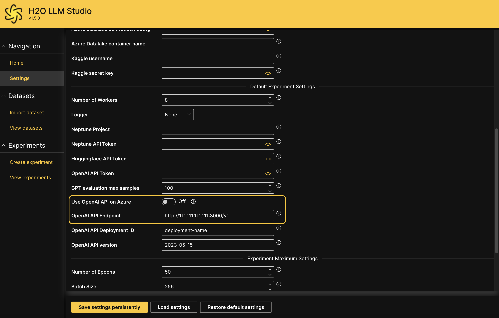
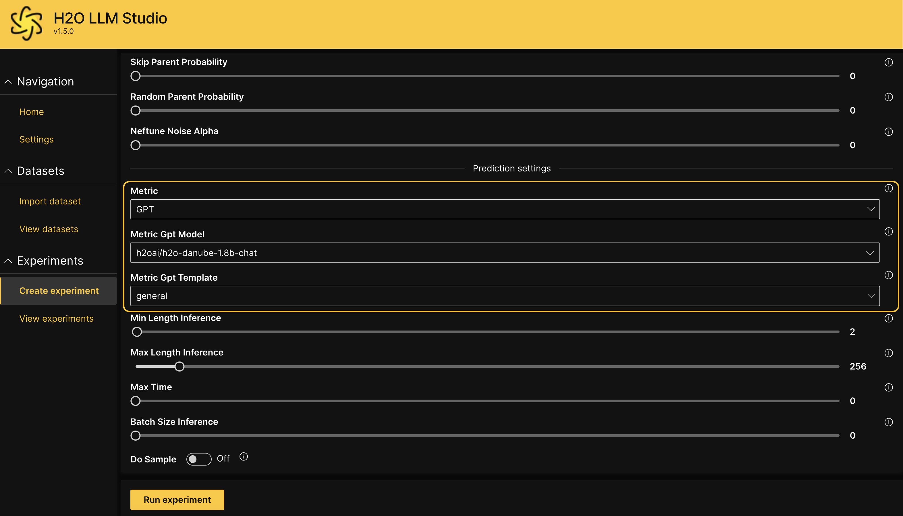
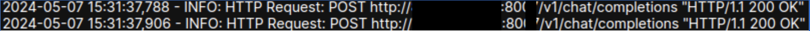

# Evaluate model using an AI judge

H2O LLM Studio provides the option to use an AI Judge like ChatGPT or a local LLM deployment to evaluate a fine-tuned model. 

Follow the instructions below to specify a local LLM to evaluate the responses of the fine-tuned model.

1. Have an endpoint running of the local LLM deployment, which supports the OpenAI API format; specifically the [Chat Completions API](https://platform.openai.com/docs/guides/text-generation/chat-completions-api).

2. Start the H2O LLM Studio server with the following environment variable that points to the endpoint. 
    ```
    OPENAI_API_BASE="http://111.111.111.111:8000/v1"
    ```

3. Once H2O LLM Studio is up and running, click **Settings** on the left navigation panel to validate that the endpoint is being used correctly. The **Use OpenAI API on Azure** setting must be set to Off, and the environment variable that was set above should be the **OpenAI API Endpoint** value as shown below. 
    

    :::info
    Note that changing the value of this field here on the GUI has no effect. This is only for testing the correct setting of the environment variable.
    :::

4. Run an experiment using `GPT` as the **Metric** and the relevant model name available at your endpoint as the **Metric Gpt Model**.
    

5. Validate that it is working as intended by checking the logs. Calls to the LLM judge should now be directed to your own LLM endpoint. 
    


