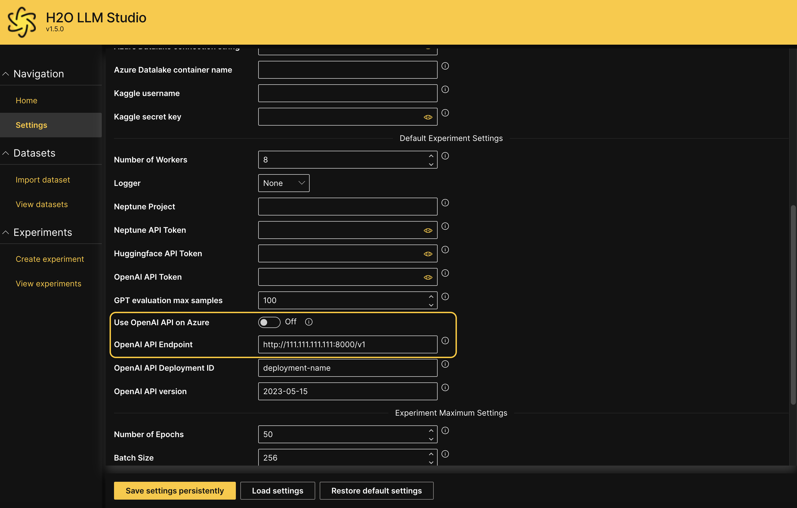
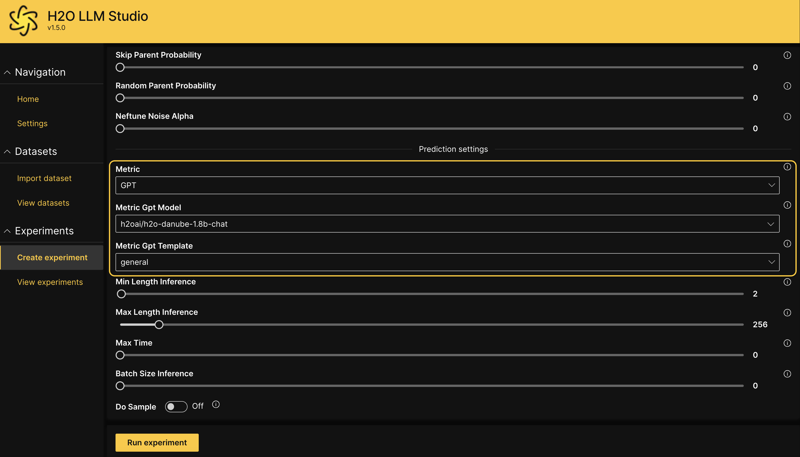
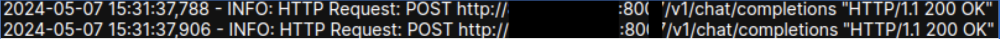

# Evaluate model using an AI judge

H2O LLM Studio provides the option to use an AI Judge like ChatGPT, MiniMax, or a local LLM deployment to evaluate a fine-tuned model.

## Using OpenAI

Set the `OPENAI_API_KEY` environment variable and select a GPT model (e.g., `gpt-4-0613`) as the **Metric Gpt Model** in your experiment configuration.

## Using MiniMax

[MiniMax](https://www.minimax.io/) provides OpenAI-compatible models that can be used as an AI judge for evaluation. To use MiniMax:

1. Set the `MINIMAX_API_KEY` environment variable to your MiniMax API key.

2. Start H2O LLM Studio. When `MINIMAX_API_KEY` is set and `OPENAI_API_KEY` is not, MiniMax is used automatically as the evaluation provider.

3. Alternatively, you can set the `MINIMAX_API_KEY` in the **Settings** page under **MiniMax API Token**.

4. Run an experiment using `GPT` as the **Metric** and a MiniMax model as the **Metric Gpt Model**:
    - `MiniMax-M2.7` — Latest flagship model with 1M context window
    - `MiniMax-M2.5` — High-quality model with 204K context
    - `MiniMax-M2.5-highspeed` — Fast variant optimized for throughput

:::tip
To explicitly select MiniMax when both `OPENAI_API_KEY` and `MINIMAX_API_KEY` are set, use the environment variable `OPENAI_API_TYPE=minimax`.
:::

## Using a local or custom LLM endpoint

Follow the instructions below to specify a local LLM to evaluate the responses of the fine-tuned model.

1. Have an endpoint running of the local LLM deployment, which supports the OpenAI API format; specifically the [Chat Completions API](https://platform.openai.com/docs/guides/text-generation/chat-completions-api).

2. Start the H2O LLM Studio server with the following environment variable that points to the endpoint.
    ```
    OPENAI_API_BASE="http://111.111.111.111:8000/v1"
    ```

3. Once H2O LLM Studio is up and running, click **Settings** on the left navigation panel to validate that the endpoint is being used correctly. The **Use OpenAI API on Azure** setting must be set to Off, and the environment variable that was set above should be the **OpenAI API Endpoint** value as shown below.
    

    :::info
    Note that changing the value of this field here on the GUI has no effect. This is only for testing the correct setting of the environment variable.
    :::

4. Run an experiment using `GPT` as the **Metric** and the relevant model name available at your endpoint as the **Metric Gpt Model**.
    

5. Validate that it is working as intended by checking the logs. Calls to the LLM judge should now be directed to your own LLM endpoint.
    


