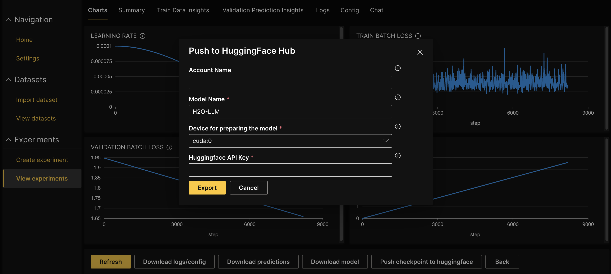

# Publish model to HuggingFace

If you are ready to share your trained model with a broader community, H2O LLM Studio allows you to export the fine-tuned model to [Hugging Face](https://huggingface.co/) with a single click.

:::info note
Before publishing your model to the Hugging Face Hub, you need to have an API key with write access. To obtain an API token with write access, follow the [instructions provided by Hugging Face](https://huggingface.co/docs/hub/security-tokens), which involve creating an account, logging in, and generating an access token with the appropriate permission.
:::

To publish a trained model to Hugging Face Hub:

1. On the H2O LLM Studio left-navigation pane, click **View experiments**. You will see the experiments table with a list of all the experiments you have launched so far. 

2. Click the name of the experiment that you want to export as a model.

3. Click **Push checkpoint to huggingface**.

4. Enter the **Account name** on Hugging Face to push the model to a particular account. Leaving it empty will push it to the default user account.

5. Enter the **Huggingface API** Key with write access.

6. Click **Export**.

    

## Download a model

1. Click **Download model** on the **View experiments** page to download the model locally.

Use the following code snippet to utilize the converted model in Jupyter Notebook or Google Colab.

```python
from transformers import AutoModelForCausalLM, AutoTokenizer

model_name = "path_to_downloaded_model"  # either local folder or huggingface model name

# Important: The prompt needs to be in the same format the model was trained with.
# You can find an example prompt in the experiment logs.
prompt = "<|prompt|>How are you?<|endoftext|><|answer|>"

tokenizer = AutoTokenizer.from_pretrained(model_name)
model = AutoModelForCausalLM.from_pretrained(model_name)
model.cuda().eval()

inputs = tokenizer(prompt, return_tensors="pt", add_special_tokens=False).to("cuda")
# generate configuration can be modified to your needs
tokens = model.generate(
    **inputs,  # Input any question for the model. Ex: "What is the capital of USA?"
    max_new_tokens=256,
    temperature=0.3,
    repetition_penalty=1.2,
    num_beams=1
)[0]
tokens = tokens[inputs["input_ids"].shape[1]:]
answer = tokenizer.decode(tokens, skip_special_tokens=True)
print(answer)
```

You can enter any question for the model and change the parameters to get different outputs. 