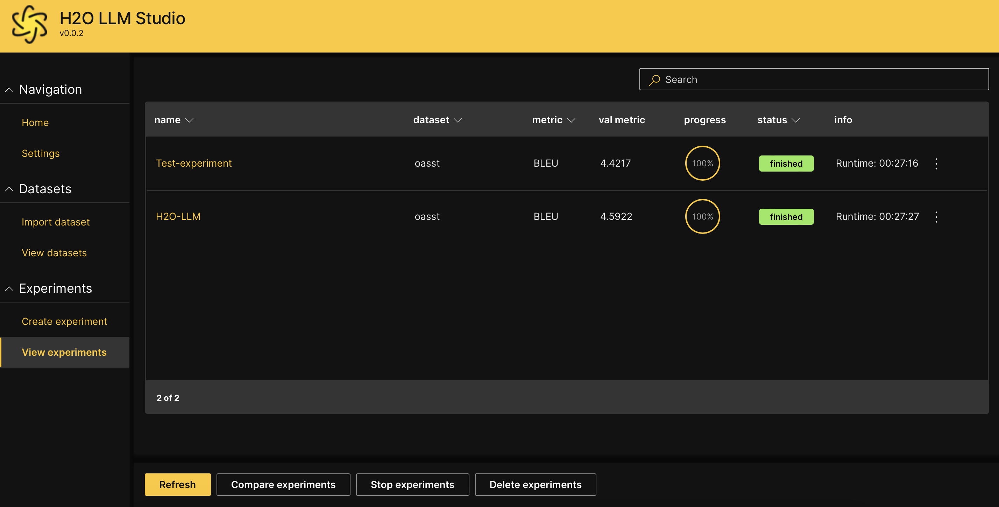
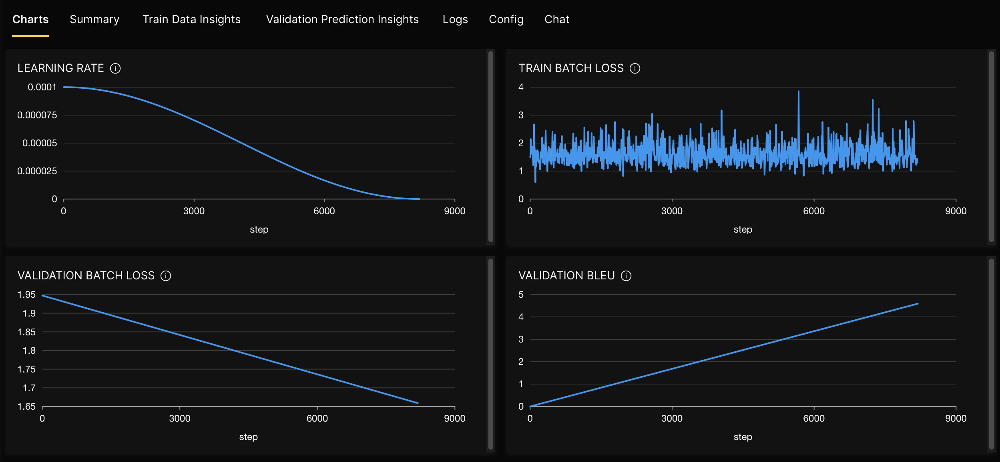
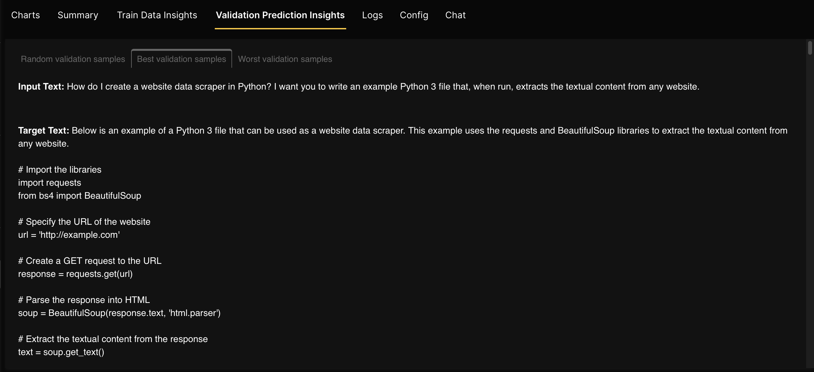
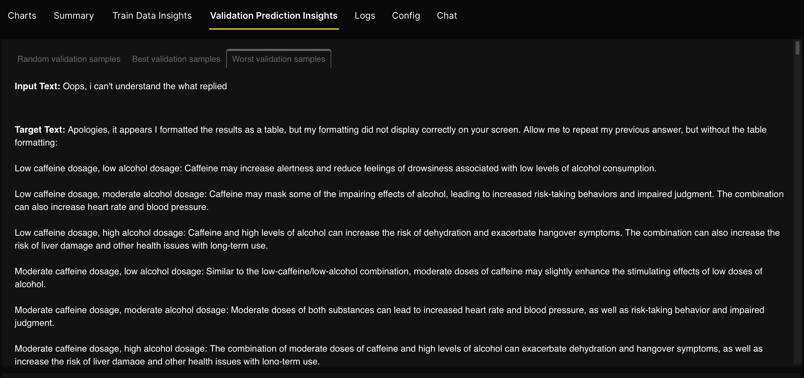
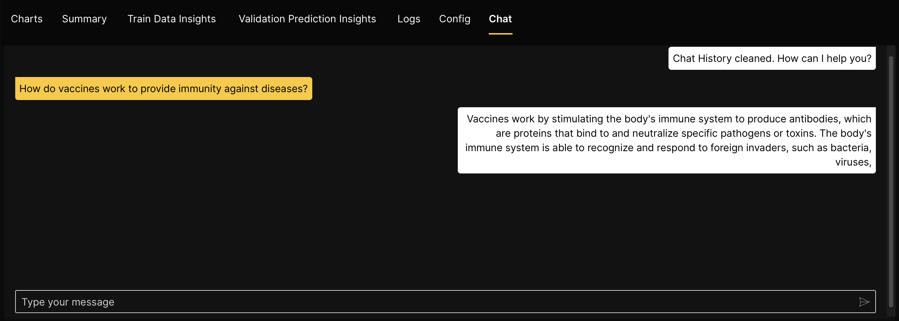
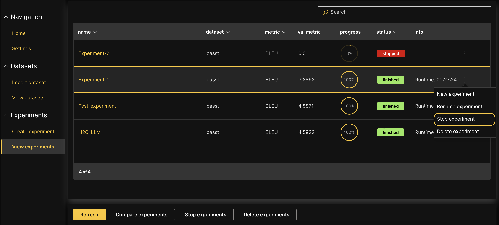
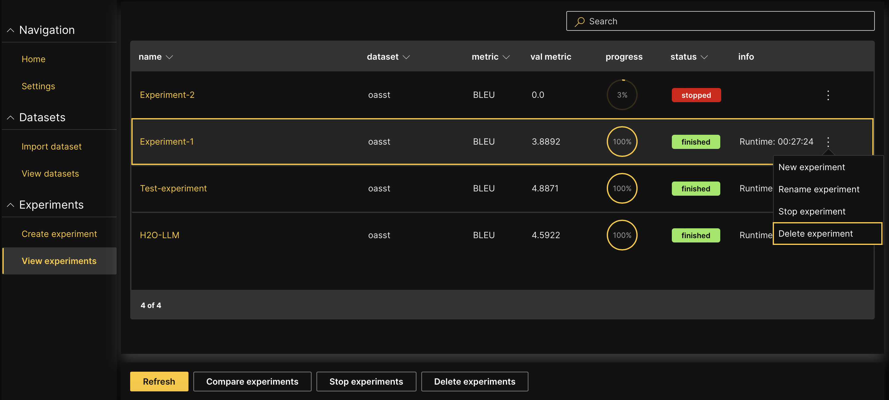

import Icon from "@material-ui/core/Icon";

# View and manage experiments

You can view, rename, stop, or delete your experiments once you launch them. You can also create a new experiment based on an experiment you have already launched.

## View an experiment

To view an experiment:

1. On the H2O LLM Studio left-navigation pane, click **View experiments**.

2. You will see the experiments table with a list of all the experiments you have launched so far. Click the name of the experiment that you want to view.

 

## Experiment tabs

Once you click the name of the experiment, you will see the following tabs that provide details and different aspects of your experiment.

- **Charts** : This tab visually represents the train/validation loss, metrics, and learning rate. These charts allow you to easily track your model’s performance as it trains.

    

- **Summary** : This tab contains the following details about an experiment.  

    | Name      | Description                          |
    | ----------- | ------------------------------------ |
    | **Name**        | Name of the experiment.  |
    | **Dataset**  | Name of the dataset. |
    | **Problem type** | The problem type of the experiment. |
    | **Seed** | The random seed value that H2O LLM Studio uses during model training. |
    | **GPU list** | The list of GPUs H2O LLM Studio can use for the experiment. |
    | **Loss** | The loss function. |
    | **Metric** | The metric to evaluate the model’s performance. |
    | **Val metric** | The measure of how well the experiment was performed. |

- **Train data insights** : This tab displays the model’s first batch, so you can verify that the input data representation is correct. Also, it provides insight into how your data is being processed and can help identify potential issues early on in the experiment.

- **Validation prediction insights** : This tab displays model predictions for random, best, and worst validation samples. This tab becomes available after the first validation run and allows you to evaluate how well your model generalizes to new data. 

    

    

    The **Worst validation samples** give you an idea of where the model is having issues, and the model can be used to fine-tune further.

- **Logs and Config tabs** : These two tabs show you the logs and configuration of the experiment. You can keep track of any changes made and quickly troubleshoot the issues that arise.

- **Chat** : This tab provides a unique opportunity to interact with your trained model and get instant feedback on its performance. The **Chat** tab becomes available after the training is completed and can be used to evaluate how well your model performs in a conversational setting. 

 :::info note
 You can use the **Chat** feature only when there are no other experiments running. The chatbot is unavailable if the GPU is occupied by another experiment.
 :::

 

## Stop an experiment

You can stop a running experiment if you no longer need it to be complted. 

1. On the H2O LLM Studio left-navigation pane, click **View experiments**.
2. Click **Stop experiments**.
3. Select the experiment(s) that you want to stop. 
4. Click **Stop experiments**.

You can also click **Stop experiment** on the <Icon>more_vert</Icon> Kebab menu of the relevant experiment row to stop an experiment from running. 

  

## Delete an experiment

When an experiment is no longer needed, you can delete it. Deleted experiments are permanently removed from the H2O LLM Studio instance.

1. On the H2O LLM Studio left-navigation pane, click **View experiments**.
2. Click **Delete experiments**.
3. Select the experiment(s) that you want to delete and click **Delete experiments**.
4. Click **Delete** to confirm deletion.

You can also click **Delete experiment** in the kebab menu of the relevant experiment row to delete an experiment. 

  