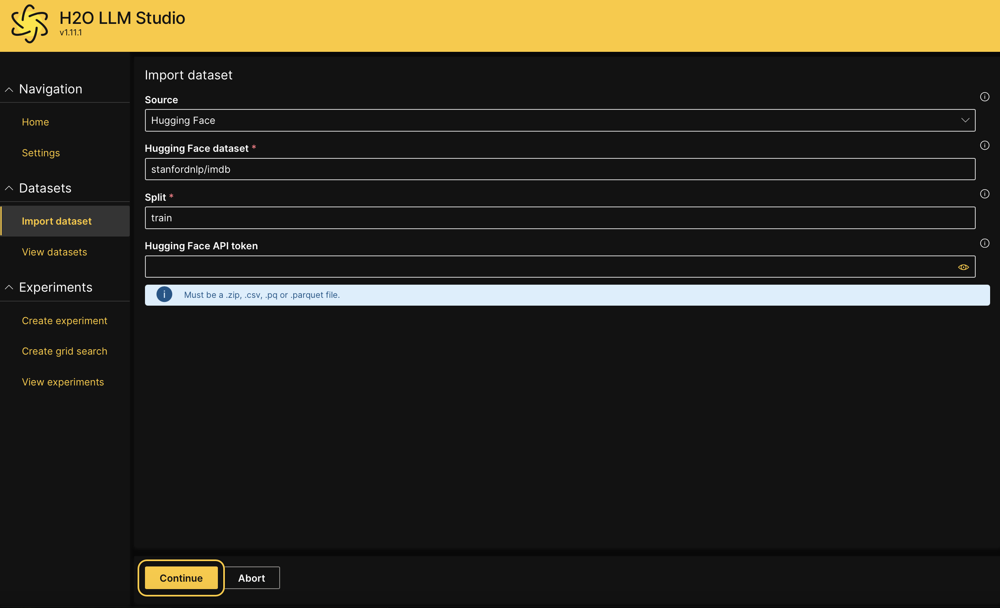
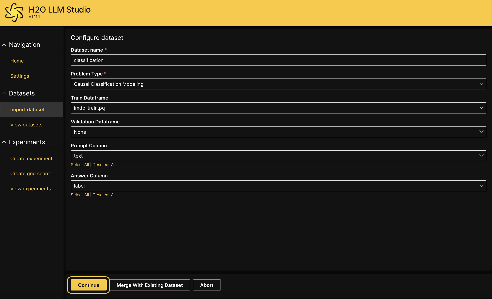
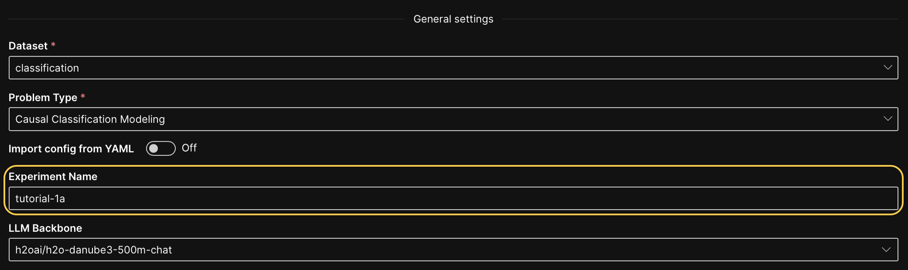
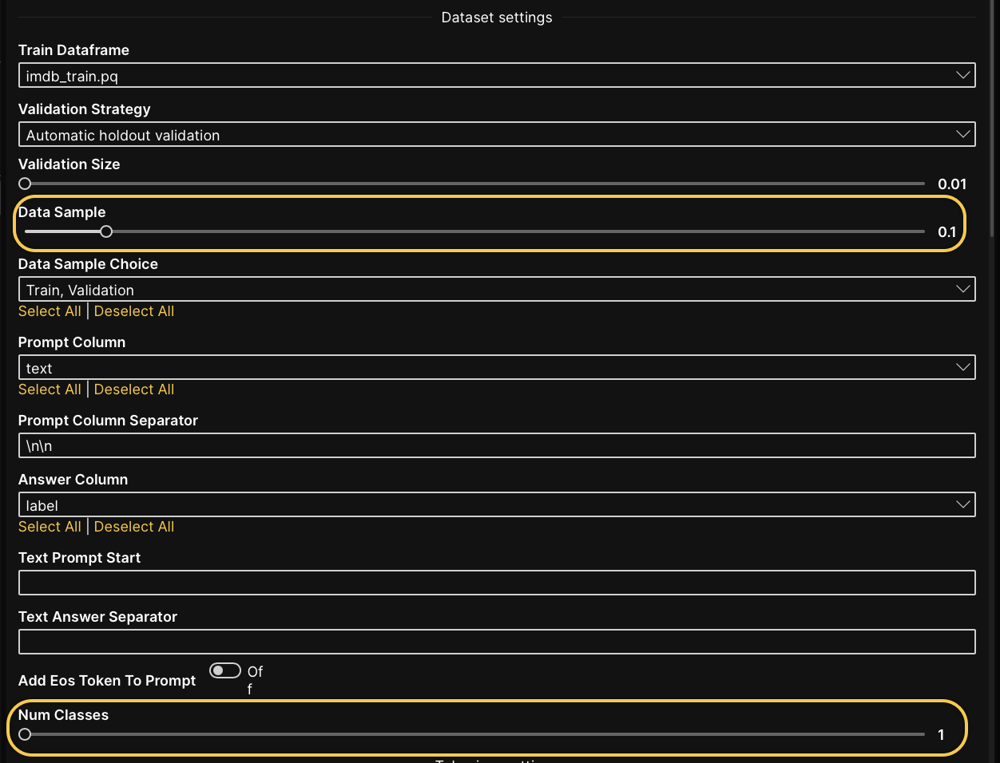
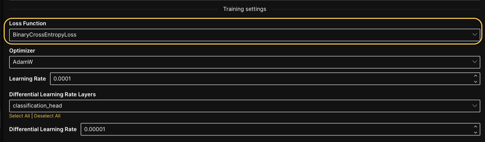
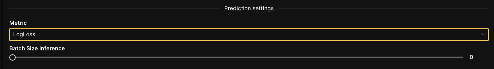
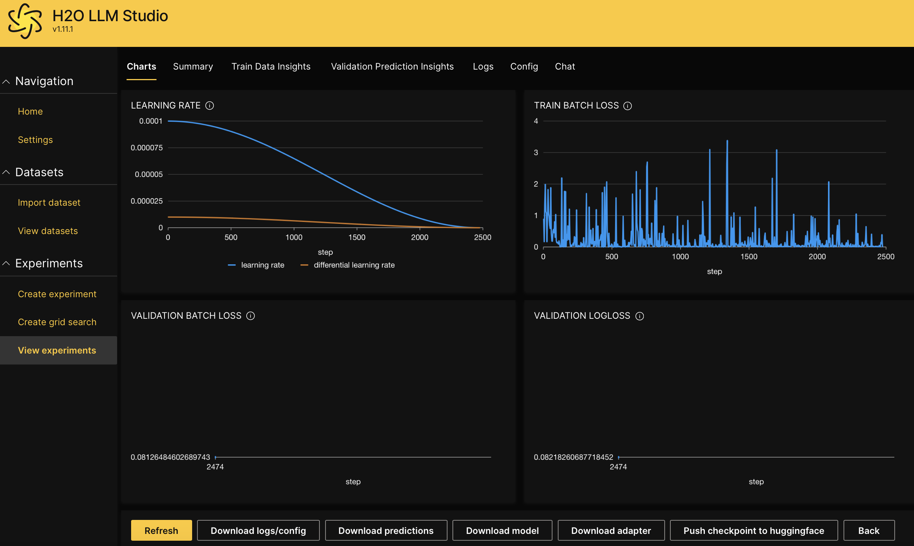

import Icon from "@material-ui/core/Icon";

# Create an experiment for causal classification modeling

## Overview

This tutorial will guide you through the process of setting up and conducting an experiment for causal classification modeling [problem type](../../guide/experiments/supported-problem-types.md) using H2O LLM Studio. It covers how to import datasets, configure key experiment settings, and create a new experiment. By following these steps, you will learn how to design experiments that can identify causal relationships in classification tasks.

## Objectives

1. Learn how to import datasets from Hugging Face into H2O LLM Studio.
2. Set up an experiment for causal classification modeling with appropriate parameters.

## Prerequisites

1. Access to the latest version of H2O LLM Studio.
2. Basic understanding of classification and causal models.

## Step 1: Import dataset

For this tutorial, we'll use the IMDb movie review dataset on Hugging Face. The dataset contains 25,000 movie reviews for training, each labeled as either positive or negative. Let's import the dataset.

1. Click on **Import dataset**.
2. Select **Hugging Face** as the data source from the **Source** dropdown. 
3. In the **Hugging Face dataset** field, enter `stanfordnlp/imdb`.
4. In the **Split** field, enter `train`.
5. Click **Continue**.

## Step 2: Configure dataset

In this step, we'll review and adjust the dataset settings for our experiment.

1. In the **Dataset name** field, enter `classification`.
2. In the **Problem type** dropdown, select **Causal classification modeling**.
 :::info note
 If the dataset is configured correctly, the **Causal classification modeling** problem type will be pre-selected automatically.
 :::
3. In the **Train dataframe** dropdown, leave the default train dataframe as `imdb_train.pq`.
4. In the **Validation dataframe** dropdown, leave the default value as `None`. 
5. In the **Prompt column** dropdown, select **Text**.
6. In the **Answer column** dropdown, select **Label**.
7. Click **Continue**.

8. In the **Sample data visualization** page, click **Continue** if the input data and labels appear correctly.

## Step 3: Create a new experiment

Now that the dataset is imported, it's time to start a new experiment for causal classification modeling.

1. From the **View datasets** page, click on the <Icon>more_vert</Icon> Kebab menu next to the `imdb_train` dataset, then select **New experiment**. 
2. In **General settings**, enter `tutorial-1a` in the **Experiment name** text box.
 
3. In **Dataset settings**, set the **Data sample** to 0.1.
4. In **Dataset settings**, set the **Num classes** to 1.
 
5. In **Training settings**, select the **BinaryCrossEntrophyLoss** from the **Loss function** dropdown. 
 
6. In **Prediction settings**, select **LogLoss** from the **Metric** dropdown.
 
7. Leave the other configurations at their default values.
8. Click **Run experiment**. 

## Step 4: Evaluate experiment

After successfully creating the new experiment, click on the experiment name to access the experiment tabs. These tabs provide detailed information and insights into various aspects of your experiment. For more information about the experiment tabs, see [Experiment tabs](../../guide/experiments/view-an-experiment.md#experiment-tabs).

## Summary

In this tutorial, we walked through the process of setting up a causal classification experiment using H2O LLM Studio. You learned how to import the IMDb dataset from Hugging Face, configure the dataset and experiment settings, and create a new experiment. With these steps, you're now ready to explore different datasets and experiment with various configurations for causal classification [problem type](../../guide/experiments/supported-problem-types.md) in H2O LLM Studio.

