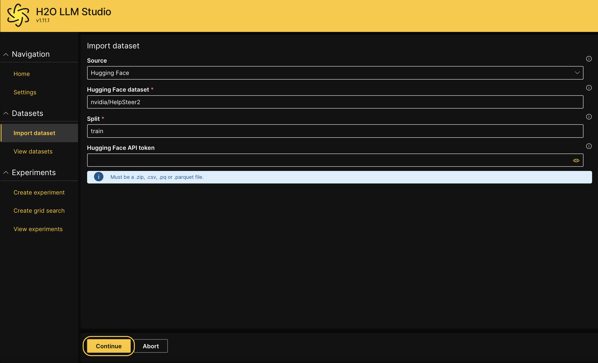
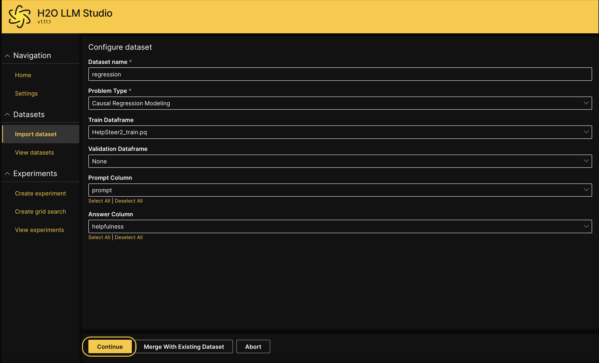
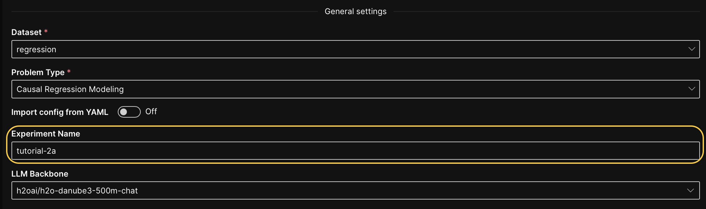
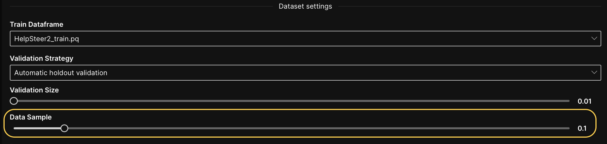
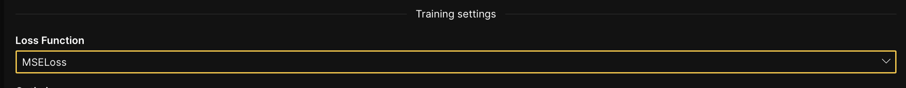
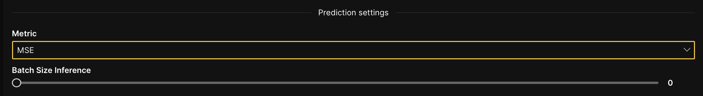
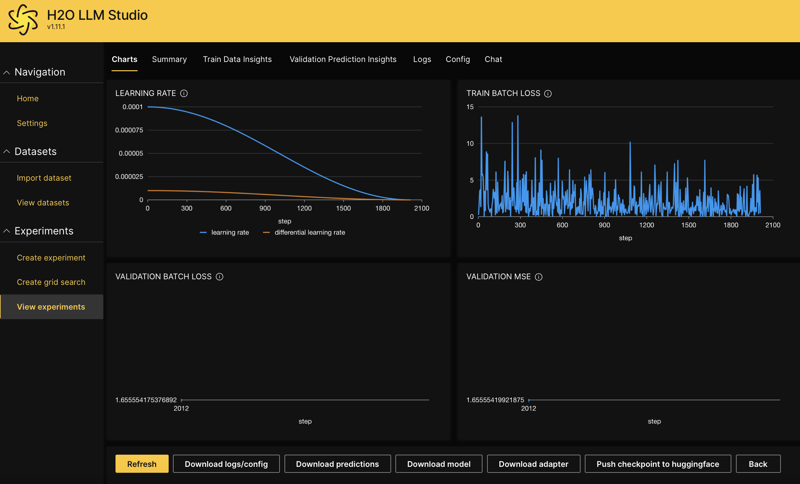

import Icon from "@material-ui/core/Icon";

# Create an experiment for causal regression modeling

## Overview

This tutorial will guide you through the process of setting up and conducting an experiment for causal regression modeling [problem type](../../guide/experiments/supported-problem-types.md) using H2O LLM Studio. It covers how to import datasets from Hugging Face, configure key experiment settings, and create a new experiment. By following these steps, you will learn how to design experiments that can identify causal relationships in regression tasks.

## Objectives

1. Learn how to import datasets from Hugging Face into H2O LLM Studio.
2. Set up an experiment for causal regression modeling with appropriate parameters.

## Prerequisites

1. Access to the latest version of H2O LLM Studio.
2. Basic understanding of regression and causal models.

## Step 1: Import dataset

For this tutorial, we'll use the open-source **Helpfulness Dataset (CC-BY-4.0)** from Hugging Face. The dataset contains 21, 362 samples, each containing a prompt, a response, and five human-annotated attributes of the response, each ranging between 0 and 4 where higher means better for each attribute.

1. Click on **Import dataset**.
2. Select **Hugging Face** as the data source from the **Source** dropdown. 
3. In the **Hugging Face dataset** field, enter `nvidia/HelpSteer2`.
4. In the **Split** field, enter `train`.
5. Click **Continue**.

## Step 2: Configure dataset

In this step, we'll review and adjust the dataset settings for our experiment.

1. In the **Dataset name** field, enter `regression`.
2. In the **Problem type** dropdown, select **Causal regression modeling**.
3. In the **Train dataframe** dropdown, leave the default train dataframe.
4. In the **Validation dataframe** dropdown, leave the default validation dataframe. 
5. In the **Prompt column** dropdown, select **Prompt**.
6. In the **Answer column** dropdown, select **helpfulness**.
7. Click **Continue**.
 
8. On the **Sample data visualization** page, click **Continue** if the input data and labels appear correctly.

## Step 3: Create a new experiment

Now that the dataset is imported, let's create a new experiment for causal regression modeling.

1. From the **View datasets** page, click on the <Icon>more_vert</Icon> Kebab menu next to the `regression` dataset, then select **New experiment**. 
2. In **General settings**, enter `tutorial-2a` in the **Experiment name** text box.
 
3. In **Dataset settings**, set the **Data Sample** to 0.1.
 
4. In **Training settings**, select the **MSELoss** from the **Loss function** dropdown.
 
5. In **Prediction settings**, select **MSE** from the **Metric** dropdown.
 
6. Leave the other configurations at their default values.
7. Click **Run experiment**.

## Step 4: Evaluate experiment

After successfully creating the new experiment, click on the experiment name to access the experiment tabs. These tabs provide detailed information and insights into various aspects of your experiment. For more information about the experiment tabs, see [Experiment tabs](../../guide/experiments/view-an-experiment.md#experiment-tabs).

## Summary

In this tutorial, we covered the process of setting up a causal regression experiment using H2O LLM Studio. You learned how to import a dataset from Hugging Face, configure both dataset and experiment settings, and create a new experiment. With these steps, you're now ready to explore other datasets and experiment with various configurations for causal regression [problem type](../../guide/experiments/supported-problem-types.md) in H2O LLM Studio.