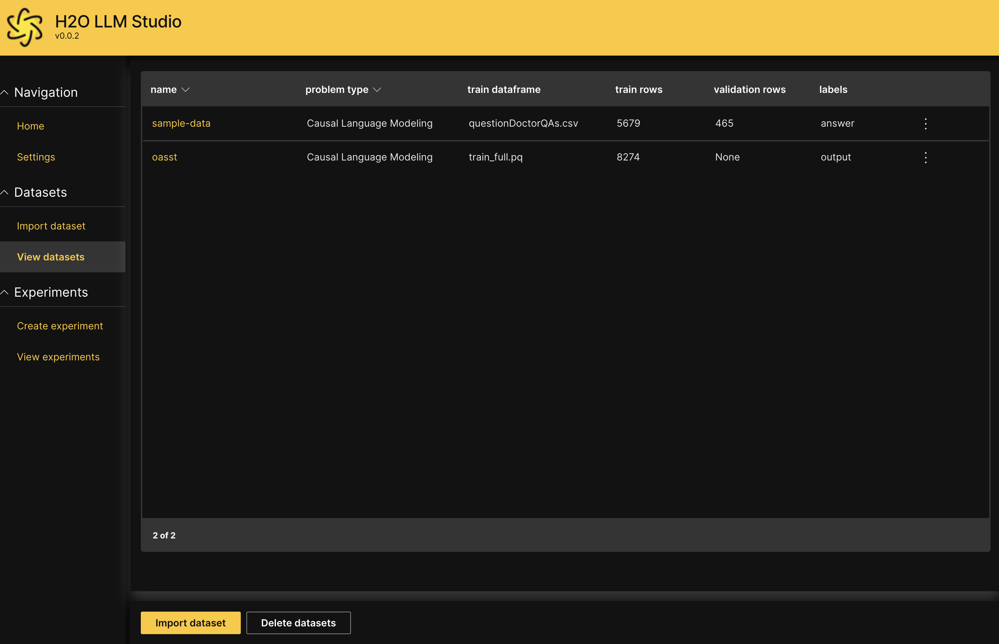

import Tabs from '@theme/Tabs';
import TabItem from '@theme/TabItem';
import Admonition from '@theme/Admonition';
import upload_dataset from './upload-dataset.png';
import upload_local_file from './upload-local-file.png';
import import_s3_bucket from './import-s3-bucket.png';
import import_kaggle_dataset from './import-kaggle-dataset.png';

# Import a dataset

H2O LLM Studio provides a number of data connectors to support importing data from local or external sources and requires your data to be in a certain format for successful importing of data. 

For more information, see [Supported data connectors and format](data-connectors-format).

## Import data

Follow the relevant steps below to import a dataset to H2O LLM Studio.

1. On the H2O LLM Studio left-navigation pane, click **Import dataset**.

2. Select the relevant **Source** (data connector) that you want to use from the dropdown list .
    :::note Data sources
    <Tabs className="unique-tabs">
    <TabItem value="upload" label="Upload" default>
        <ol>
        <li>
        Drag and drop the file, or click <b>Browse</b> and select the file you want to upload.
        </li>
        <li>
        Click <b>Upload</b>.
        
        </li>
        </ol>
    </TabItem>
    <TabItem value="local" label="Local">
        <ol>
        <li>
        Enter the file path as the <b>File Location</b> or select the relevant local directory that the dataset is located in. 
        </li>
        <li>
        Click <b>Continue</b>.
        
        </li>
        </ol>
    </TabItem>
    <TabItem value="aws" label="AWS S3">
        <ol>
        <li>
        Enter values for the following fields:
            <ul>
            <li>
            <b>S3 bucket name: </b>   
            The name of the S3 bucket including the reletive file paths.
            </li>
            <li>
            <b>AWS access key: </b>  
            The access key associated with your S3 bucket. This field is optional. If the S3 bucket is public, you can leave this empty for anonymous access. 
            </li>
            <li>
            <b>AWS access secret: </b>  
            The access secret associated with your S3 bucket. This field is optional. If the S3 bucket is public, you can leave this empty for anonymous access.
            </li>
            <li>
            <b>File name: </b>  
            Enter the file name of the dataset that you want to import. 
            </li>
            </ul>
            

            <Admonition type="info" title="Note">
                
For more information, see <a href="https://docs.aws.amazon.com/IAM/latest/UserGuide/security-creds.html#access-keys-and-secret-access-keys">AWS credentials</a> and <a href="https://docs.aws.amazon.com/AmazonS3/latest/userguide/access-bucket-intro.html">Methods for accessing a bucket</a> in the AWS Documentation.

            </Admonition>
            

        </li>
        <li>
        Click <b>Continue</b>.
        
        </li>
        </ol>
    </TabItem>
    <TabItem value="kaggle" label="Kaggle">
        <ol>
        <li>
        Enter values for the following fields:
            <ul>
            <li>
            <b>Kaggle API command: </b>  
            Enter the Kaggle API command that you want to execute.
            </li>
            <li>
            <b>Kaggle username: </b>  
            Your Kaggle username for API authentication
            </li>
            <li>
            <b>Kaggle secret key: </b>  
            Your Kaggle secret key for API authentication.
            </li>
            </ul>
        </li>
        <li>
        Click <b>Continue</b>.
        
        </li>
        </ol>
    </TabItem>
    </Tabs>
    :::
 
## Configure dataset

Once you have successfully uploaded or imported your dataset, you can configure the dataset settings.

**Dataset name:** A suitable name for the whole dataset which includes both the train dataframe and validation dataframe. 

<!-- Internal notes: ** include tooltip .mdx files here for the rest of the configs!! ** -->

## Data validity check

H2O LLM Studio will provide a preview of the dataset input (sample questions) and output (sample answers) according to the content of the imported dataset. Review the text to ensure that the input and output is as intended, and then click **Continue**. 

## View dataset

You will now be redirected to the **View datasets** screen. You should be able to see the dataset you just imported listed on the screen. 

For more information about viewing dataset summary and statistics, see [View and manage datasets](./view-dataset.md)